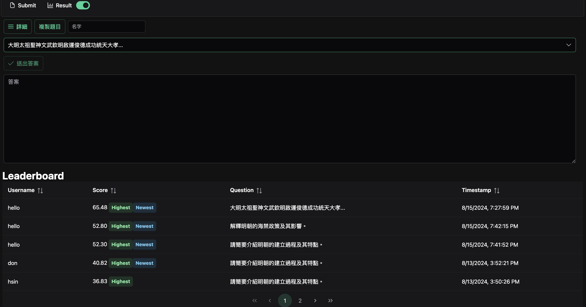
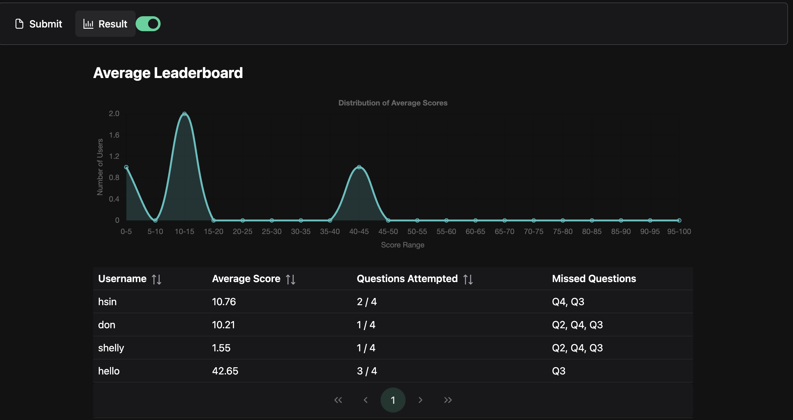

# Prompt Evaluation System



## Evaluation Process

The system evaluates user responses using multiple metrics:

1. **TF-IDF Similarity**

   - Measures word importance and text similarity

2. **BLEU Score**

   - Assesses fluency and similarity to reference answer

3. **ROUGE-L Score**

   - Evaluates based on longest common subsequence

4. **BERTScore**

   - Uses BERT embeddings for semantic similarity

5. **Prompt Relevance**
   - Compares answer relevance to the original prompt
6. **GPT-score**
   - evaluates the prompt, answer and the students answer in multiple aspects including the meaning and completeness of the student answer

## Process

1. User submits an answer
2. System calculates each metric
3. Weighted average of metrics produces final score
4. Score is used for leaderboard ranking

This multi-faceted approach ensures a comprehensive evaluation of content, fluency, and relevance.

## Data Models

- QuestionModel: Represents a question with its prompt and reference answer.
- AnswerInput: Represents a user's submitted answer.
- EvaluationResult: Contains the calculated metrics for a submitted answer.
- LeaderboardEntry: Represents an entry in the leaderboard with score and metadata.

## API Endpoints

- GET <mark>/questions</mark>: Returns the list of available questions.
- POST <mark>/evaluate</mark>: Accepts a user's answer and returns evaluation metrics.
- GET <mark>/leaderboard</mark>: Returns the current leaderboard data.

## Setup

must add an OPENAI_API_KEY to the.env file in the root folder

after going into the <mark>server</mark> folder and downloading the requirements

```
pip install -r requirments
```

from the root folder (Bench4Prompt folder) activate the server

```
uvicorn server.main:app --host 0.0.0.0 --port 8000 --reload
```

and then go to the <mark>bench</mark> folder and activate the frontend

```
npm install
npm run dev
```

# Result

you can find the Results in the /result page

